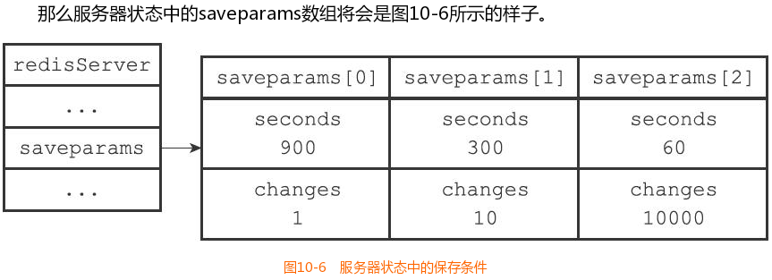

#### 该笔记源自黄健宏《Redis设计与实现》
#### 简介
RDB持久化既可以手动执行，也可以根据服务器配置选项定期执行，该功能可以将某个时间点上的数据库状态保存到一个RDB文件中。
RDB持久化功能所生成的RDB文件是一个经过压缩的二进制文件，通过该文件可以还原生成RDB文件时的数据库状态。
#### RDB文件创建与载入
##### 文件创建
有两个Redis命令可以用于生成RDB文件，一个是SAVE，另一个是BGSAVE。这两个命令可以手动触发，也可以自动触发。
* SAVE命令 会阻塞Redis服务器进程，直到RDB文件创建完毕为止，在服务器进程阻塞期间，服务器不能处理任何命令请求。
* BGSAVE命令 会派生出一个子进程，然后由子进程负责创建RDB文件，服务器进程（父进程）继续处理命令请求。关于 BGSAVE 更多细节信息可参考《Redis深度历险：未雨绸缪—持久化》
##### 文件载入
和使用SAVE命令或者BGSAVE命令创建RDB文件不同，RDB文件的载入工作是在服务器启动时自动执行的，所以Redis并没有专门用于载入RDB文件的命令，只要Redis服务器在启动时检测到RDB文件存在，它就会自动载入RDB文件。因为AOF文件的更新频率通常比RDB文件的更新频率高，所以：如果服务器开启了AOF持久化功能，那么服务器会优先使用AOF文件来还原数据库状态。
##### 服务器状态
当SAVE命令执行时，Redis服务器会被阻塞，所以当SAVE命令正在执行时，客户端发送的所有命令请求都会被拒绝。只有在服务器执行完SAVE命令、重新开始接受命令请求之后，客户端发送的命令才会被处理。
BGSAVE命令的保存工作是由子进程执行的，所以在子进程创建RDB文件的过程中，Redis服务器仍然可以继续处理客户端的命令请求。
服务器在载入RDB文件期间，会一直处于阻塞状态，直到载入工作完成为止。
##### 自动保存
BGSAVE命令可以在不阻塞服务器进程的情况下执行，所以Redis允许用户通过设置服务器配置的save选项，让服务器每隔一段时间自动执行一次BGSAVE命令。用户可以通过save选项设置多个保存条件，但只要其中任意一个条件被满足，服务器就会执行BGSAVE命令。
    save 900 1
    save 300 10
    save 60 10000
那么只要满足以下三个条件中的任意一个，BGSAVE命令就会被执行：↓
    服务器在900秒之内，对数据库进行了至少1次修改。
    服务器在300秒之内，对数据库进行了至少10次修改。
    服务器在60秒之内，对数据库进行了至少10000次修改。
服务器程序会根据save选项所设置的保存条件，设置服务器状态redisServer结构的saveparams属性：

```c
struct redisServer {
    // ...
    // 记录了保存条件的数组
    struct saveparam *saveparams;
    // ...
};
```
saveparams属性是一个数组，数组中的每个元素都是一个saveparam结构，每个saveparam结构都保存了一个save选项设置的保存条件：
```c
struct saveparam {
    // 秒数
    time_t seconds;
    // 修改数
    int changes;
};
```


除了saveparams数组之外，服务器状态还维持着一个dirty计数器，以及一个lastsave属性：
dirty计数器记录距离上一次成功执行SAVE命令或者BGSAVE命令之后，服务器对数据库状态（服务器中的所有数据库）进行了多少次修改（包括写入、删除、更新等操作）。
lastsave属性是一个UNIX时间戳，记录了服务器上一次成功执行SAVE命令或者BGSAVE命令的时间。

```c
struct redisServer {
    // ...
    //修改计数器
    long long dirty;
    //上一次执行保存的时间
time_t lastsave;
    // ...
};
```
当服务器成功执行一个数据库修改命令之后，程序就会对dirty计数器进行更新：命令修改了多少次数据库，dirty计数器的值就增加多少。
例如，如果我们向一个集合键增加三个新元素：SADD database Redis MongoDB MariaDB。那么程序会将dirty计数器的值增加3。
##### 检查保存条件
Redis的服务器周期性操作函数serverCron默认每隔100毫秒就会执行一次，该函数用于对正在运行的服务器进行维护，它的其中一项工作就是检查save选项所设置的保存条件是否已经满足，如果满足的话，就执行BGSAVE命令
```python
def serverCron():
    # ...
    # 遍历所有保存条件
    for saveparam in server.saveparams:
        # 计算距离上次执行保存操作有多少秒
	    save_interval = unixtime_now()-server.lastsave
        # 如果数据库状态的修改次数超过条件所设置的次数
        # 并且距离上次保存的时间超过条件所设置的时间
        # 那么执行保存操作
        if server.dirty >= saveparam.changes and save_interval > saveparam.seconds:
            BGSAVE()
    # ...
```
程序会遍历并检查saveparams数组中的所有保存条件，只要有任意一个条件被满足，那么服务器就会执行BGSAVE命令。
#### RDB文件结构
以后再说！
